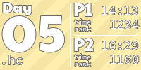

# AoC Tiles

This script creates a graphic for each day for each year of the Advent of Code. 
A tile is an image which represents both parts of a day, it looks like this:

Theme: `aoc`


Theme: `modern`


It uses the personal [AoC Leaderboard](https://adventofcode.com/2023/leaderboard/self) to get the data for each day using your cookie. 

## Updating old installations

1. Update the version of aoc_tiles to the **newest** one, see github release or tags
2. Update your session.cookie (take it from the browser storage)
3. Delete cache in .aoc_tiles/cache
4. Run it with `pre-commit run --hook post-commit` or make a commit

## Installation

I have rewritten this script to make it a lot easier to use. 
Now you **only** need to install `pre-commit`, add a pre-commit hook and add two HTML comments to your README. More details below.

### Install `pre-commit`:

```bash
pip install pre-commit
```

or the more modern way below (either is fine, modern pip in Python 3.11+ 
will [not allow the above command to run though](https://veronneau.org/python-311-pip-and-breaking-system-packages.html)):

```bash
# if you don't have pipx, install it with pip install pipx, or with your package manager
pipx install pre-commit  
```

### Add pre-commit hook to your repository

Add this pre-commit hook to your `.pre-commit-config.yaml` (create it, if you don't have it):

```yaml
repos:
    - repo: https://github.com/LiquidFun/aoc_tiles
      rev: 0.7.0
      hooks:
          - id: aoc-tiles
            # Optionally use these arguments. Auto add tiles to git adds the tiles to git,
            # possibly amends your commit by creating the tile images and updating the README.
            # Language sorting shows the preference of the order of the languages to use.
            # Exclude paterns are globs which can be used to exclude files when creating
            # the tiles. See the customization section in the README for more flags.
            # Simply remove the comments (#) below for args and the flags you want.
            # args:
            #     - --auto-add-tiles-to-git=amend
            #     - --language-sorting=jl,kt,py,rs
            #     - --exclude-patterns=2021/*/*.apl,2021/*/*.py,2021/*/*.cpp
            #     - --theme=aoc
            #     - --animation=snow
```

Now **install** the hook with:

```
pre-commit install --hook-type post-commit
```  

The **--hook-type post-commit** flag is important, otherwise the hook will not run.

There are a lot more flags, see the customization section for all of them.
Note that you have to prepend `- ` to the flags if you add it to the .pre-commit config, due to the yaml syntax.
Auto add tiles is recommended as it will automatically add the tiles to your git repository, otherwise you might
forget it and the tiles will not be updated. Note that this will amend your just created commit. If you do not want
this, remove that flag.


### Set-up

Add this to your .gitignore:

```
.aoc_tiles/*
!.aoc_tiles/tiles/
```

Now add `<!-- AOC TILES BEGIN -->` and `<!-- AOC TILES END -->` in your README, everything between these 2 tags
will always be replaced by the script, so do not add additional information there. Note that these are HTML comments,
so they will not be visible in the rendered README.

Now you are done and the basic version should trigger once you commit with git. 

### Configuration

If you care about your submit-time and rank, you need to add your session cookie to the script. 
By default, if no session cookie is found, checkmarks will be used instead of the time and rank.
Add in the `.aoc_tiles` directory as `session.cookie`.
Make sure that this file is in your `.gitignore`, i.e. do **not** add it to `.aoc-tiles/tiles/`!
It should contain a single line, the "session" cookie from https://adventofcode.com when you are logged in. 
No prefix is needed, only the string of length 128. 
It resets after 30 days, so you need to renew it for each year.


## Customization

There are various flags which can be set to change the look of your tiles. Some of them are listed here
with examples showing how it changes the look.

<!-- **Note that in order to regenerate images you have to either delete the images or delete the .aoc-tiles-cache!** -->

* `--what-to-show-on-right-side=`:

| `auto` (default)                                         | `checkmark`               | `time_and_rank`                |
|----------------------------------------------------------|---------------------------|--------------------------------|
| `time_and_rank` if cookie is available, else `checkmark` |  |  |

* `--contrast-improvement-type=`:

| `outline` (default)          | `dark`                 | `none`                 |
|-----------------------------|--------------------------|--------------------------|
|  |  |  |

### All Flags

```

  --theme THEME
    Visual theme for the tiles. 'modern' uses the current colorful design with PaytoneOne font. 
    'aoc' uses a retro terminal style similar to Advent of Code website. 
    Possible values: [modern,aoc] Default: "modern"

  --animation ANIMATION
    Animation to apply to tiles. 'none' creates static PNG images. 'snow' creates animated GIFs with falling
    snow effect. Possible values: [none,snow] Default: "none"

  --what-to-show-on-right-side WHAT_TO_SHOW_ON_RIGHT_SIDE
    What information to display on the right side of each tile. 'checkmark' only displays a checkmark for each
    part if the day is solved. 'time_and_rank' displays the time and rank on the global leaderboard (requires
    session.cookie). 'loc' displays the number of lines of code of the solution (not implemented). 'auto' will use
    'time_and_rank' if session.cookie exists, otherwise 'checkmark'. Possible values:
    [auto,checkmark,time_and_rank] Default: "auto"

  --count-as-solved-when COUNT_AS_SOLVED_WHEN
    Condition to count a task as solved. Note that 'on_leaderboard', 'either' and 'both' require a session cookie.
    'auto' will use 'both' if session.cookie exists, otherwise 'file_exists'. Possible values:
    [auto,on_leaderboard,file_exists,either,both] Default: "auto"

  --language-sorting LANGUAGE_SORTING
    Preferred language extensions order for sorting. For example 'py,rs,js' will make Python solutions appear
    first, then Rust, then JavaScript, then everything else (alphabetically).

  --create-all-days     Whether to create entries for all days upfront. Default: "False"

  --auto-add-tiles-to-git AUTO_ADD_TILES_TO_GIT
    Whether to automatically add the tile images to git. 'add' will add new files, 'amend' will add and amend the
    commit with the new files. 'no' will not add the files to git. Possible values: [no,add,amend] Default: "no"

  --only-use-solutions-in-git
    If true, only solutions will be considered which are tracked by git (git added), otherwise all solutions will
    be used. This is useful for example to ignore auto-generatedfiles, like '.d' in Rust or '.o' files in C++.
    Default: "True"

  --show-total-stars-for-all-years SHOW_TOTAL_STARS_FOR_ALL_YEARS
    Whether to add an additional header in front which shows the total collected stars for all years.'auto' will
    only show the header if you have stars in at least 3 separate years. 'yes' will always show the header. 'no'
    will never show the header. Possible values: [no,auto,yes] Default: "auto"

  --year-pattern YEAR_PATTERN
    Regex pattern for matching years. This extracts the first group as the year and parses it as an integer. Make
    sure that other numbers are not matched by this pattern! For example, using negative lookbehind and lookaheads
    is encouraged to avoid matching longer numbers! Default: "(?<!\d)(20[123]\d)(?!\d)"

  --day-pattern DAY_PATTERN
    Regex pattern for matching days. Same as year_pattern. Default: "(?<!\d)([012]?\d)(?!\d)"

  --exclude-patterns EXCLUDE_PATTERNS
    A list of comma separated glob patterns to ignore when looking for solutions. Listing the paths works too. For
    example: '*.py,*.js', '2023/05/05.c' or '2021/**.py'.Make sure to escape the patterns with single quotes when
    running from the shell! Do NOT escape them when using the flag in the yaml! Otherwise the qoute will be part
    of the pattern.

  --overwrite-year OVERWRITE_YEAR
    If your repository only contains a single year and it cannot be parsed from the path, then you should use this
    to overwrite the year. Every solution is presumed to be for this year. Default: "None"

  --contrast-improvement-type CONTRAST_IMPROVEMENT_TYPE
    Some languages have very light colors and are hard to see with a white font. Here you can choose how the text
    color changes when the background is too light. 'dark' makes the font dark, 'outline' adds a black outline.
    Possible values: [none,outline,dark] Default: "outline"

  --contrast-improvement-threshold CONTRAST_IMPROVEMENT_THRESHOLD
    Threshold for contrast improvement feature (between 0 and 255). Default: "30"

  --outline-color OUTLINE_COLOR
    Color used for outlining elements. Default: "#6C6A6A"

  --not-completed-color NOT_COMPLETED_COLOR
    Color to signify incomplete tasks. Default: "#333333"

  --top100-color TOP100_COLOR
    Color to highlight top 100 ranking. Only used if sessioncookie is provided. Default: "#ffdd00"

  --text-color TEXT_COLOR
    Text color. Default: "#FFFFFF"

  --tile-width-px TILE_WIDTH_PX
    Width of tiles in pixels. You likely don't needto change this. Default: "161px"
```
